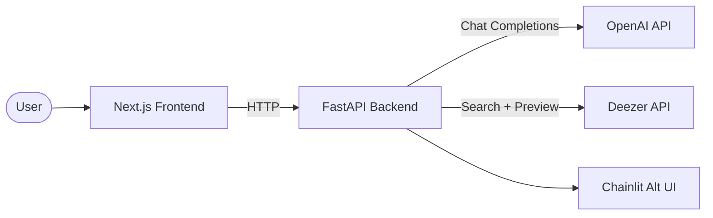

# Radio Boy — AI Music Agent

[](https://github.com/TechAviator200/radio-boy/actions/workflows/ci.yml)
[](https://github.com/TechAviator200/radio-boy/actions/workflows/security.yml)
[](https://github.com/TechAviator200/radio-boy/actions/workflows/codeql.yml)

Radio Boy is an AI-powered music agent that generates personalized music
recommendations through a conversational interface and streams 30-second
previews. It demonstrates end-to-end full-stack development with an LLM-driven
chat UI — built as a portfolio project to showcase AI agent design, API
integration, and modern web development practices.

---

## Tech Stack & Integrations

| Layer | Technology | Notes |
|---|---|---|
| **LLM** | Powered by **OpenAI** (chat completions) | API key via env var — no keys in repo |
| **Music library** | Music data via **user's API** (Deezer search + 30 s previews) | No secrets stored; configured at deploy time |
| **Backend** | Python 3.11, FastAPI, uvicorn, httpx | Async HTTP, CORS-restricted |
| **Frontend** | Next.js 16, React 19, TypeScript, Tailwind CSS 4 | Static export + SSR-ready |
| **Alt UI** | Chainlit chat interface (`backend/chainlit/`) | Alternative conversational frontend |

---

## Architecture



| Component | Role |
|---|---|
| **Frontend** | Renders the chat interface, sends user messages to the backend |
| **Backend** | Orchestrates LLM calls, searches music catalog, returns recommendations with preview URLs |
| **OpenAI** | Generates natural-language music recommendations from user prompts |
| **Deezer** | Provides track search results and 30-second audio previews |

---

## Getting Started

```bash
# Backend
cd backend
python -m venv .venv && source .venv/bin/activate
pip install -r requirements.txt
cp .env.example .env   # add your OPENAI_API_KEY
uvicorn radio_boy_app:app --reload

# Frontend
cd frontend
npm install
npm run dev
```

---

## Security Posture & Boundaries

**Current scope:** portfolio, not a production SaaS.

All secrets (API keys, tokens) are handled via environment variables and never
committed to the repository. `.env` files are gitignored. Deployment platforms
should use their native secret manager.

Automated checks running in CI:

| Check | Tool | Status |
|---|---|---|
| Secret scanning | gitleaks | Runs on every push & PR |
| Python dependency audit | pip-audit | Runs on every push & PR |
| Python SAST | bandit | Runs on every push & PR (B104 suppressed — see below) |
| JS/TS dependency audit | npm audit | Runs on every push & PR (production deps only) |
| Deep code analysis | CodeQL | Runs on every push, PR & weekly |
| Dependency updates | Dependabot | Weekly PRs for pip, npm, GitHub Actions |

> **B104 suppression:** Bandit flags `host="0.0.0.0"` as a potential bind-all-interfaces
> risk. This is the standard and required pattern for container deployments
> (Render, Docker, Heroku). The binding is in the `if __name__ == "__main__"` guard
> and does not affect production reverse-proxy configurations.

For the full threat model, trust boundaries, and production hardening path, see
[docs/security.md](docs/security.md).

---

## Project Structure

```
radio-boy/
├── backend/
│   ├── radio_boy_app.py       # FastAPI main application
│   ├── requirements.txt
│   └── chainlit/              # Alternative Chainlit UI
├── frontend/                  # Next.js frontend
│   ├── src/app/               # App router pages
│   ├── package.json
│   └── tsconfig.json
├── radioboy_ui_backup/        # Archived legacy UI (not active)
├── docs/
│   └── security.md            # Threat model & security policy
└── .github/
    ├── workflows/
    │   ├── ci.yml             # Build & compile checks
    │   ├── security.yml       # gitleaks, pip-audit, bandit, npm audit
    │   └── codeql.yml         # CodeQL deep analysis
    └── dependabot.yml         # Automated dependency updates
```
